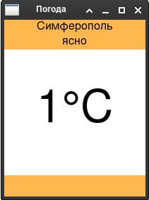
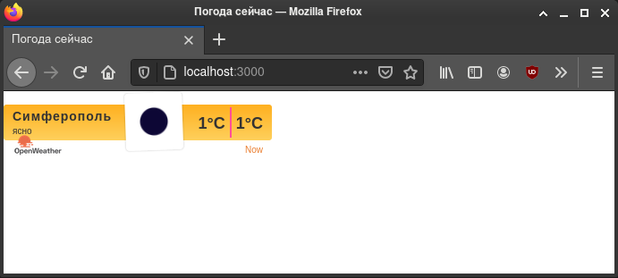

<p align="center">МИНИСТЕРСТВО НАУКИ  И ВЫСШЕГО ОБРАЗОВАНИЯ РОССИЙСКОЙ ФЕДЕРАЦИИ<br>
Федеральное государственное автономное образовательное учреждение высшего образования<br>
"КРЫМСКИЙ ФЕДЕРАЛЬНЫЙ УНИВЕРСИТЕТ им. В. И. ВЕРНАДСКОГО"<br>
ФИЗИКО-ТЕХНИЧЕСКИЙ ИНСТИТУТ<br>
Кафедра компьютерной инженерии и моделирования</p>
<br>
<h3 align="center">Отчёт по лабораторной работе № 1<br> по дисциплине "Программирование"</h3>
<br><br>
<p>студента 1 курса группы ИВТ-б-о-201(1)<br>
Шульженко Владимира Владимировича<br>
направления подготовки 09.03.01 "Информатика и вычислительная техника"</p>
<br><br>
<table>
<tr><td>Научный руководитель<br> старший преподаватель кафедры<br> компьютерной инженерии и моделирования</td>
<td>(оценка)</td>
<td>Чабанов В.В.</td>
</tr>
</table>
<br><br>
<p align="center">Симферополь, 2020</p>
<hr>

<!--  -->
## Цель:

1. Закрепить навыки разработки многофайловыx приложений;
2. Изучить способы работы с API web-сервиса;
3. Изучить процесс сериализации/десериализации данных в/из json;
4. Получить базовое представление о сетевом взаимодействии приложений;

## Постановка задачи
Разработать сервис предоставляющий данные о погоде в городе Симферополе на момент запроса. В качестве источника данных о погоде использовать: http://openweathermap.org/. В состав сервиса входит: серверное приложение на языке С++ и клиентское приложение на языке Python.
Серверное приложение (далее Сервер) предназначенное для обслуживания клиентских приложений и минимизации количества запросов к сервису openweathermap.org. Сервер должен обеспечивать возможность получения данных в формате JSON и виде html виджета (для вставки виджета на страницу будет использоваться iframe).
Клиентское приложение должно иметь графический интерфейс отображающий сведения о погоде и возможность обновления данных по требованию пользователя.

## Выполнение работы
<!--
    API key полученный на сервисе openweathermap.org;
    Запрос составленный в пункте I.7;
    Запрос составленный в пункте II;
    Полный исходный код серверного приложения;
    Полный исходный код клиентского приложения;
    Скриншот графического интерфейса клиентского приложения. Только окно программы, лишнее обрезать;
    Скриншот браузера с загруженными виджетом.
-->
Для начала был зарегистрирован аккаунт openwheatermap.org. API ключ по-умолчанию созданный сервисом: 4b4b143c5f50ea5d5810563a8346acc0.

Затем были произведены несколько тестовых запросов, чтобы убедиться, что они не имеют ошибок и вывод правилен.

Запрос, созданный к серверу погоды включает в себя широту и долготу места, для которого необходимо получить погоду, исключить все типы прогноза кроме почасового, ключ API, метрические единицы изменения (цельсий) и описание на русском языке: 

api.openweathermap.org/data/2.5/onecall?lat=45.0522222222&lon=33.9744444444&exclude=current,minutely,daily,alerts&appid=4b4b143c5f50ea5d5810563a8346acc0&units=metric&lang=ru

Запрос для сервера погоды включает в себя город, время которого необходимо получить:

http://worldtimeapi.org/api/timezone/Europe/Simferopol

Исходный код сервера:
```cpp
// Файл include/utils.hpp
#pragma once
#include "nlohmann/json.hpp"
using json = nlohmann::json;

// Makes request to openweathermap and returns json response or json {"err": message}.
json get_json();

// Returns cache from `cache.json` or or json {"err": message}.
json get_cache();

// Writes json to `cache.json`. Pass empty json to clear cache file.
bool cache_json(json j);

// Gets json of time from worldtimeapi.org
json get_time();

// Gets forecast for this hour from hourly array. In case of error returns empty object.
json get_hour_forecast(const json &hourly);

// https://thispointer.com/find-and-replace-all-occurrences-of-a-sub-string-in-c/
void findAndReplaceAll(std::string &data, std::string toSearch, std::string replaceStr);


// Файл server.cpp
#include <iostream>
#include <iomanip>
#include <fstream>
#include <string>
#include <ctime>

#include "include/cpp-httplib/httplib.h"
#include "include/nlohmann/json.hpp"
#include "include/logger.hpp"
#include "include/utils.hpp"

using json = nlohmann::json;
using namespace httplib;

void gen_response_test(const Request &req, Response &res) {
    res.set_content("Test successful!", "text/plain");
}

void gen_response(const Request &req, Response &res) {
    json hour_forecast;
    json body;
    
    bool retry = false;
    do {
        body = get_cache();
        if (body.empty()) {
            body = get_json();
            if (!body["err"].is_null()) {
                res.set_content(body["err"], "text/plain");
                return;
            }
			cache_json(body);
        } else if (!body["err"].is_null()) {
            res.set_content(body, "text/json");
        }
        
        hour_forecast = get_hour_forecast(body["hourly"]);
        if (!hour_forecast["err"].is_null()) {
            if (retry) {
                res.set_content(hour_forecast["err"], "text/plain");
                return;
            }
        }
    } while (retry);
    

    std::string template_file_name = "template.html";
    std::ifstream template_file(template_file_name);
    std::string site;
    
    if (template_file.is_open()) {
        getline(template_file, site, '\0');
        template_file.close();
    } else {
        res.set_content("Error! Could not open `template.html` file.", "text/plain");
        return;
    }

    findAndReplaceAll(site, "{hourly[i].weather[0].description}", 
			hour_forecast["weather"][0]["description"]);
    findAndReplaceAll(site, "{hourly[i].weather[0].icon}", 
			hour_forecast["weather"][0]["icon"]);
    findAndReplaceAll(site, "{hourly[i].temp}", 
			std::to_string(int(std::round(hour_forecast["temp"].get<double>()))));

    res.set_content(site, "text/html");
}

void gen_response_raw(const Request &req, Response &res) {
    json hour_forecast;
    json body;
    
    bool retry = false;
    do {
        body = get_cache();
        if (body.empty()) {
            body = get_json();
            if (!body["err"].is_null()) {
                res.set_content(body, "text/json");
                return;
            }
        } else if (!body["err"].is_null()) {
            res.set_content(body, "text/json");
        }
        
        hour_forecast = get_hour_forecast(body["hourly"]);
        if (!hour_forecast["err"].is_null()) {
            if (retry) {
                res.set_content(hour_forecast["err"], "text/plain");
                return;
            }
        }
    } while (retry);
    
    cache_json(body);

    std::string template_file_name = "template.html";
    std::ifstream template_file(template_file_name);
    std::string site;
    
    if (template_file.is_open()) {
        getline(template_file, site, '\0');
        template_file.close();
    } else {
        res.set_content("{\"err\":\"Could not open `template.html` file\"}", "text/json");
        return;
    }

    json out;
    out["temp"] = hour_forecast["temp"];
    out["description"] = hour_forecast["weather"][0]["description"];

    res.set_content(out.dump(), "text/json");
}

int main() {
    Server svr;
    svr.Get("/", gen_response);
    svr.Get("/raw", gen_response_raw);
    svr.Get("/test", gen_response_test);

    svr.listen("localhost", 3000);
}


// Файл utils.cpp
#include <fstream>
#include "include/cpp-httplib/httplib.h"
#include "include/nlohmann/json.hpp"
using json = nlohmann::json;
using namespace httplib;

// TODO: Load from `config.json` file.
Client owm("http://api.openweathermap.org");
std::string latitude  = "45.0522222222";
std::string longitude = "33.9744444444";
std::string exclude   = "current,minutely,daily,alerts";
std::string lang      = "ru";
std::string units     = "metric";
std::string appid     = "4b4b143c5f50ea5d5810563a8346acc0";

Client time_srv("http://worldtimeapi.org");

// https://thispointer.com/find-and-replace-all-occurrences-of-a-sub-string-in-c/
void findAndReplaceAll(std::string &data, std::string toSearch, std::string replaceStr) {
    size_t pos = data.find(toSearch);
    while (pos != std::string::npos) {
        data.replace(pos, toSearch.size(), replaceStr);
        pos = data.find(toSearch, pos + replaceStr.size());
    }
}

json get_json() {
    std::string request = "/data/2.5/onecall?lat=" + latitude + "&lon=" + longitude +
        "&exclude=" + exclude + "&appid=" + appid + "&units=" + units + "&lang=" + lang;
    
	auto result = owm.Get(request.c_str());
	
	if (!result) {
		return {"err", "Request to weather server wasn't successful"};
	}
	
	int status_code = result->status;

    if (status_code < 200 || status_code >= 300) {
		return {"err", "Got non-successful code " + std::to_string(status_code) + "."};
	}
	findAndReplaceAll(result->body, "\\\"", "\"");
	
	return json::parse(result->body);
}

json get_cache() {
	json cache;
	std::ifstream cache_file("cache.json");
    if (cache_file.is_open()) {
        std::string content;
        getline(cache_file, content, '\0');
		
        if (!content.empty()) {
            cache = json::parse(content);
		}
		cache_file.close();
    } else {
		return {"err", "Could not open `cache.json` to read cache."};
	}
	return cache;
}

bool cache_json(json j) {
	std::ofstream cache_file("cache.json");
	if (cache_file.is_open()) {
		cache_file << j;
		cache_file.close();
	} else {
		return false;
	}
    return true;
}

json get_time() {
    std::string request = "/api/timezone/Europe/Simferopol";
    
	auto result = time_srv.Get(request.c_str());
	
	if (!result) {
		return {"err", "Request to time server wasn't successful"};
		
        return json::object();
	}
	
	int status_code = result->status;

    if (status_code < 200 || status_code >= 300) {
        return {"err", "Got non-successful code " + std::to_string(status_code) + "."};
	}
	findAndReplaceAll(result->body, "\\\"", "\"");
	
	return json::parse(result->body);
}

json get_hour_forecast(const json &hourly) {
	json hour_forecast;
	
    int last = hourly.size() - 1;
    int current_time;
    json time_j = get_time();
    if (time_j["err"].is_null()) {
        current_time = time_j["unixtime"];
    } else {
        current_time = std::time(0); // in case of fail, use system time.
    }
	
    if (hourly[last]["dt"] < current_time) {
        return json::object();
    }
	
    for (int i = 0; i <= last; ++i) {
        if (hourly[i]["dt"] >= current_time) {
            hour_forecast = hourly[i];
            break;
        }
    }
    return hour_forecast;
}
```

Исходный код клиента:
```python
from tkinter import *
import json
import requests

def reload_data(event=None):
	try:
		response = requests.get('http://localhost:3000/raw').content.decode("utf8")
		forecast_j = json.loads(response)

		desc.config(text=str(forecast_j["description"]))
		temp.config(text=str(forecast_j["temp"]) + "°C")
	except requests.exceptions.ConnectionError:
		pass

root = Tk()
root.title("Погода")
root.pack_propagate(0)
root.bind("<Button-1>", reload_data)

_yellow = "#ffb84d"
_white = "#ffffff"
_w = 100
_h = 30

top_frame =    Frame(root, bg=_yellow, width=_w, height=_h)
middle_frame = Frame(root, bg=_white,  width=_w, height=_h*3)
bottom_frame = Frame(root, bg=_yellow, width=_w, height=_h)

top_frame.pack(side=TOP, fill=X)
middle_frame.pack(expand=True, fill=BOTH)
bottom_frame.pack(side=BOTTOM, fill=X)

city = Label(top_frame, font=("Calibri Bold", 12), text="Симферополь", bg=_yellow)
desc = Label(top_frame, font=("Calibri", 12), bg=_yellow)
temp = Label(middle_frame, font=("Impact", 48), bg=_white)

city.pack(pady=0)
desc.pack(pady=0)
temp.pack(expand=True)

reload_data()
root.mainloop()
```

Скриншот клиента:



Скриншот виджета:



## Вывод по работе. 
Цель работы была успешно достигнута. Было выполнено:
- Создание сервера на языке С++, обращающегося к  сайту openweathermap.com и возвращающий виджет или описание и температуру в формате json
- Приложение с графическим интерфейсом, написанное на языке Python с использованием библиотеки Tkinter, получающее и обрабатывающее данные из сервера.
