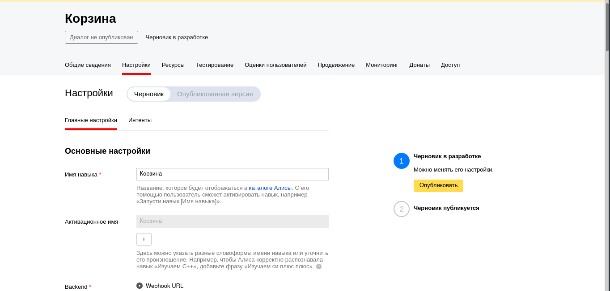
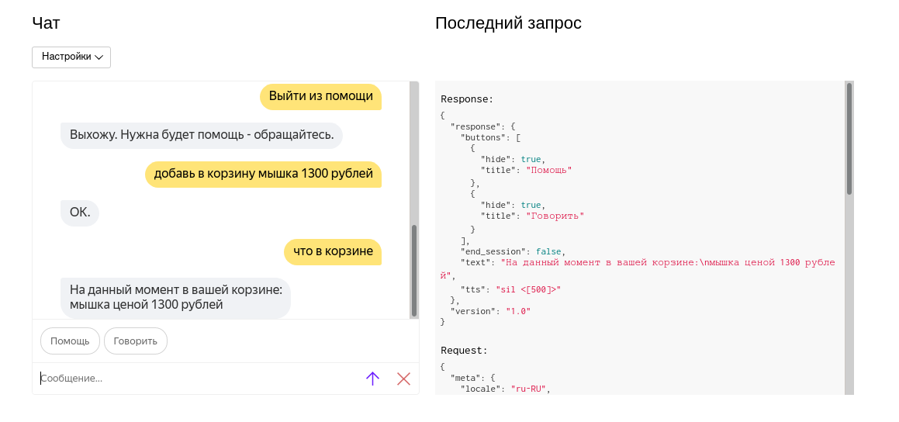
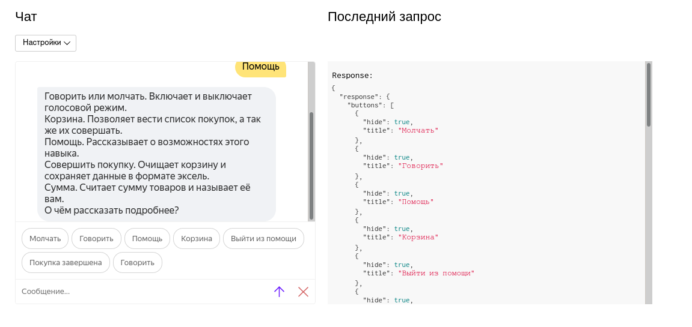
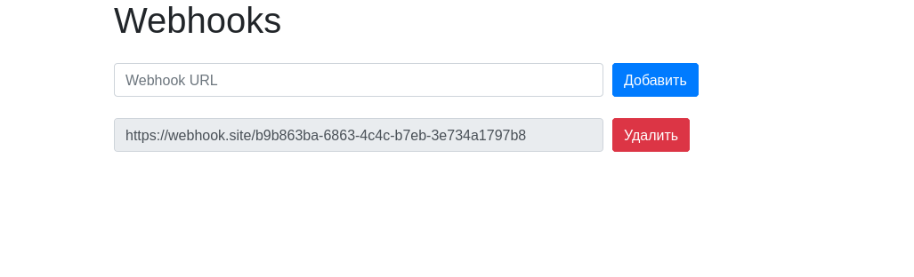

МИНИСТЕРСТВО НАУКИ  И ВЫСШЕГО ОБРАЗОВАНИЯ РОССИЙСКОЙ ФЕДЕРАЦИИ 
Федеральное государственное автономное образовательное учреждение высшего образования 
"КРЫМСКИЙ ФЕДЕРАЛЬНЫЙ УНИВЕРСИТЕТ им. В. И. ВЕРНАДСКОГО" 
ФИЗИКО-ТЕХНИЧЕСКИЙ ИНСТИТУТ 
Кафедра компьютерной инженерии и моделирования

 
<h3 align="center">Отчёт по лабораторной работе № 2  по дисциплине "Программирование"</h3>
  

студента 1 курса группы ИВТ-б-о-201(1) Шульженко Владимира Владимировича 
направления подготовки 09.03.01 "Информатика и вычислительная техника"

  
<table>
<tr><td>Научный руководитель  старший преподаватель кафедры  компьютерной инженерии и моделирования</td>
<td>(оценка)</td>
<td>Чабанов В.В.</td>
</tr>
</table>
  

Симферополь, 2020

## Цель
1. Получить представления о структуре post-запроса;
2. Изучить webhooks как метод взаимодействия web-приложений;

## Постановка задачи

Разработать и зарегистрировать навык для Алисы на сервисе Яндекс.Диалоги;

В качестве backend-a для навыка реализовать приложение на языке С++ выполняющее следующие функции:

- Составление продуктовой корзины:
    - Добавление продукта в корзину;
    - Удаление продукта из корзины;
    - Очистка корзины;
    - Вывод списка товаров в корзине;
    - Подсчёт стоимости товаров в корзине.

- Вывод справочной информации по навыку;

- Регистрацию webhook-ов сторонних сервисов;

- Отправку данных на сторонние сервисы. 

В качестве стороннего сервиса реализовать приложение на языке Python, выполняющее следующие функции:
    Ожидание данных о покупке;
    Сохранение поступивших данных в excel-документ.

## Выполнение работы
<!--
    Скриншот со страницы настроек навыка (должно быть видно название);
    Демонстрация работы функционала Корзина (достаточно скриншота с диалогом);
    Демонстрация работы функционала Помощь (достаточно скриншота с диалогом);
    Скриншот страницы управления webhook-ами с добавленным webhook-ом клиентского приложения;
    Ссылка на excel-файл заполненный клиентским приложением. Сам файл разместить в репозитории. Не обязательно делать 1000 записей, размер буфера можно уменьшить;
    Полный исходный код серверного приложения;
    Полный исходный код клиентского приложения;
-->
<!-- data.xlsx  default-mode.png  help-mode.png  settings-screenshot.png  webhooks.png -->

В начале работы был создан навык на странице яндекса. Название было выбрано лаконичное, чётко отражающее суть навыка -- "Корзина".

Рисунок 1. Скриншот настроек.

Далее была написана логика работы с диалогом Yandex.

В основном использовалось поле в запросе "command", которое содержит текст сообщения в нижнем регистре и очищенный от знаков препинания.

Для получения цены использовалась функция выделения сущностей в сообщении. К примеру, яндекс может определить улицу в сообщении пользователя, человека или число.
Пригодилось ещё поле, разделяющее command по словам в один массив. Из него программа получает название товара после фразы "добавь в корзину" до начала числа,
которое получается из данных сущности.

К сожалению, найти в документации способ заставить молчать Алису не был найден, поэтому применён костыль в виде инструкции произнести паузу между слов.

Рисунок 2. Скриншот диалога в обычном режиме.

Рисунок 3. Скриншот диалога в режиме помощи.

Веб-страница управления вебхуками генерируется простейшим образом. Для каждого вебхука из конфигурационного файла ссылка на вебхук заменяется 
в шаблоне для вебхука и добавляется в конец временной строки. После этой временной строкой заменяется место, предназначенное для списка вебхуков.

Рисунок 4. Скриншот панели управления вебхуками.

Далее было написано приложение на Python, которое получает json от сервера на C++ и добавляет каждый предмет как отдельную строку в буфер.
Если размер буфера превышает определённое число (1000 строк), то строки из буфера переносятся в документ excel и в клетку F1 записывается число --
следующая строка для записи в excel.

Ссылка на файл excel:

[doc/data.xlsx](doc/data.xlsx)

Ссылка на исходный код на C++:

Инициализация сервера: [main.cpp](C++/Project1/main.cpp)

Логика работы с яндекс диалогами: [yandex.cpp](C++/Project1/yandex.cpp)

Логика работы с вебхуками и конфигурационными файлами: [webhooks.cpp](C++/Project1/webhooks.cpp)

Ссылка на исходный код на Python:

[script.py](Python/script.py)

## Вывод

Я научился работать с системой навыков Яндекс, читать из файлов, работать с такими системами как REST, писать файлы в Excel из Python и улучшил свои знания в данных аспектах.
