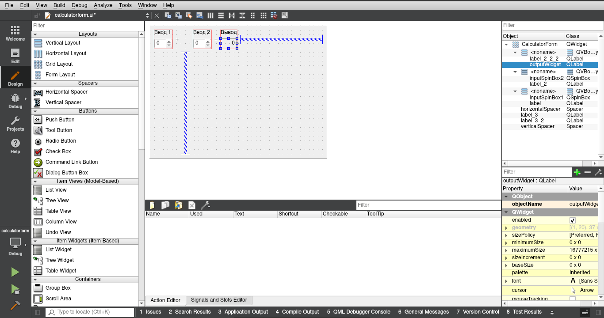

МИНИСТЕРСТВО НАУКИ  И ВЫСШЕГО ОБРАЗОВАНИЯ РОССИЙСКОЙ ФЕДЕРАЦИИ 
Федеральное государственное автономное образовательное учреждение высшего образования 
"КРЫМСКИЙ ФЕДЕРАЛЬНЫЙ УНИВЕРСИТЕТ им. В. И. ВЕРНАДСКОГО" 
ФИЗИКО-ТЕХНИЧЕСКИЙ ИНСТИТУТ 
Кафедра компьютерной инженерии и моделирования

 
<h3 align="center">Отчёт по лабораторной работе № 4  по дисциплине "Программирование"</h3>
  

студента 1 курса группы ИВТ-б-о-201(1) 
Шульженко Владимир Владимирович 
направления подготовки 09.03.01 "Информатика и вычислительная техника"

  
<table>
<tr><td>Научный руководитель  старший преподаватель кафедры  компьютерной инженерии и моделирования</td>
<td>(оценка)</td>
<td>Чабанов В.В.</td>
</tr>
</table>
  

Симферополь, 2020

## Постановка задачи
Настроить рабочее окружение, для разработки программного обеспечения при помощи Qt и IDE Qt Creator, а также изучить базовые возможности данного фреймворка.

## Выполнение работы

### Задание 1
Вначале был скачан QT Creator с помощью пакетного менеджера, а так же компилятор C++ и дебаггер: 
`pacman -S qtcreator qt5-examples lldb llvm clang`

Был открыт пример **Calculator Form Example**.

В настройках был настроен проект, нажата кнопка **Configure**, в редакторе была открыта форма и изменен текст "Input 1", "Input 2", "Output" на "Ввод 1", "Ввод 2" и "Вывод" соответственно.

Рисунок 1. Редактор формы Qt Creator

### Задание 2
**Как изменить цветовую схему (оформление) среды?** 
Tools -> Options -> Environment -> Interface -> Theme

**Как закомментировать/раскомментировать блок кода средствами Qt Creator? Имеется ввиду комбинация клавиш или пункт меню.** 
`Ctrl+/`

**Как открыть в проводнике Windows папку с проектом средствами Qt Creator?** 
Я использую ОС GNU/Linux, здесь проект можно открыть с помощью File -> Open file or Project

**Какое расширение файла-проекта используется Qt Creator? Может быть несколько ответов.** 
`<имя проекта>.pro` для билд-системы от QT 
`CMakeLists.txt` для билд-системы CMake и файлы `*.cmake` для библиотек.

**Как запустить код без отладки?** 
Нажать на зелёный треугольник слева снизу или Build -> Run (Ctrl+R)

**Как запустить код в режиме отладки?** 
Нажать на зелёный треугольник с жучком слева снизу или Debug -> Start debugging

**Как установить/убрать точку останова (breakpoint)?** 
Нажать слева от нумерации строки либо переместить курсор на нужную строку и нажать Debug -> Toggle Breakpoing (F9)

### Задание 3
**Чему равны переменные i и d в 6 строке?** 
d = 0.0 
i = 32767

**Чему равны переменные i и d в 7 строкe?** 
d = 0.0 
i = 5

**Чему равны переменные i и d в 8 строке?** 
d = 5.0 
i = 5

## Вывод
По ходу работы с Qt Creator я научился 
- создавать проект,
- базово настраивать среду,
- редактировать некоторые параметры объектов в форме,
- редактировать форму и код в данном IDE,
- открывать примеры проектов и обучаться с их помощью.
